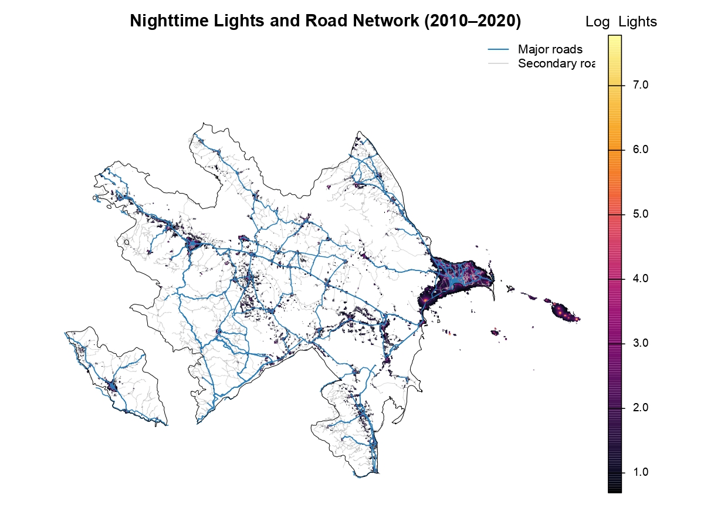
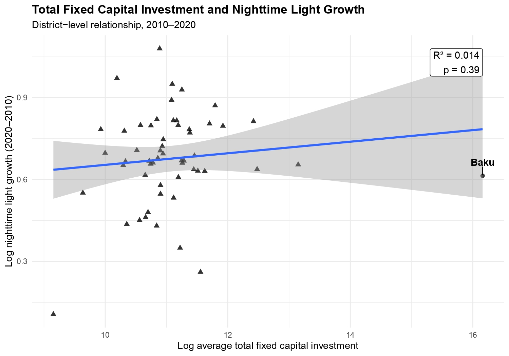

# Roads, Oil, and Local Economic Activity in Azerbaijan: A Causal Analysis Using Nighttime Lights

[](https://www.repostatus.org/#wip)
[-blue.svg)]()

> ⚠️ **Project Status: Work in Progress (WIP)**  
> This thesis project is currently under active development. The repository, analysis scripts, and preliminary outputs are subject to change as the research progresses.

---

## 📌 Project Overview
This project investigates how oil-related macroeconomic dynamics and investment shocks influence localized economic activity across Azerbaijan. Utilizing high-resolution satellite-based **nighttime lights (NTL)** as a proxy for economic development, the empirical strategy exploits annual global oil price variations coupled with spatial exposure models to estimate heterogeneous local effects.

This repository contains the replication code and empirical framework for my Master's Thesis at **TU Dresden**.

---

## 🔬 Research Question
> **"How do oil-related investment shocks affect local economic activity across different regions in Azerbaijan, and how does proximity to infrastructure mitigate or amplify these shocks?"**

---

## 📊 Key Visualizations & Descriptive Plots (Preliminary)

Here are some preliminary insights and geographic distributions from the current stage of the analysis:

### 1. Spatial Distribution of Nighttime Lights & Infrastructure
Below is the baseline map showcasing the intensity of nighttime lights across Azerbaijan alongside the major road networks.



### 2. Macroeconomic Trends: Night Lights Growth vs. Total fixed Investment
This plot tracks the historical Night Lights Growth and total fixed capital investment at the district level.



---

## 💾 Data Sources

The empirical analysis harmonizes high-resolution spatial datasets with district-level macroeconomic indicators:

| Data Source | Variable / Proxy | Spatial Resolution | Temporal Coverage |
| :--- | :--- | :--- | :--- |
| **SVNL / VIIRS (via Google Earth Engine)** | Nighttime Light Intensity | Pixel Level | 2010 – 2020 (Annual) |
| **OpenStreetMap (OSM)** | Distance to Major & Secondary Roads | Pixel Level | Static Cross-Section |
| **State Statistical Committee of AR** | Total Fixed Capital Investment | District Level | 2010 – 2020 (Annual) |
| **World Bank Commodity Data** | Global Brent Oil Prices | National Level | 2010 – 2020 (Annual) |
| **GADM 4.1** | Administrative Boundaries | District/Country | Version 4.1 |

---

## 📐 Empirical Strategy

The main reduced-form panel specification is formulated as follows:

$$Y_{it} = \beta (Oil_t \times Distance_i) + \alpha_i + \lambda_t + \varepsilon_{it}$$

Where:
* $Y_{it}$: Nighttime light intensity at pixel $i$ in year $t$.
* $Oil_t$: Annual Brent oil price benchmark.
* $Distance_i$: Spatial distance from pixel $i$ to Baku (or core economic hubs).
* $\alpha_i$: Spatial (pixel/district) fixed effects to control for time-invariant local characteristics.
* $\lambda_t$: Year fixed effects to capture national macroeconomic shocks.
* $\varepsilon_{it}$: Idiosyncratic error term.

**Additional Robustness Checks:**
* District-level fixed effects.
* Control variables for road network proximity (OSM).
* First-stage validation linking oil prices directly to local fixed capital investment.

---

## 🚀 Running the Analysis

### 1. Clone the Repository
```bash
git clone [<repository-url>](https://github.com/mammadov-elvin/Master-Thesis-Elvin.git)
cd repository-name
