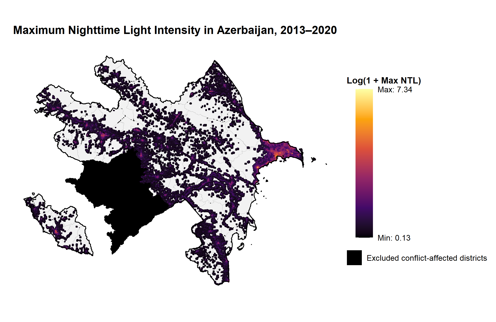
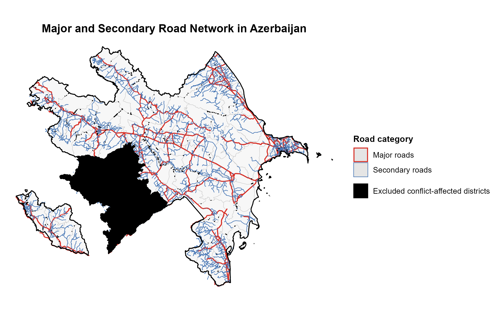
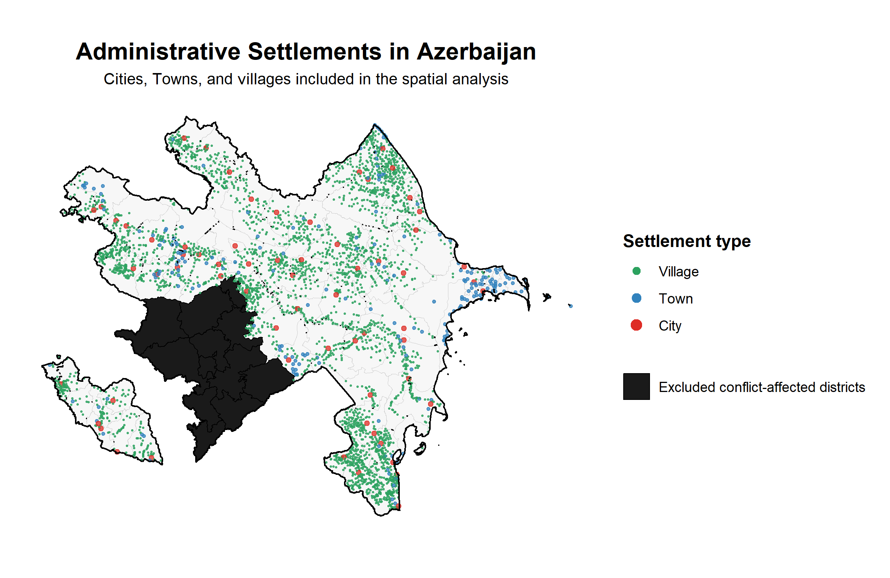
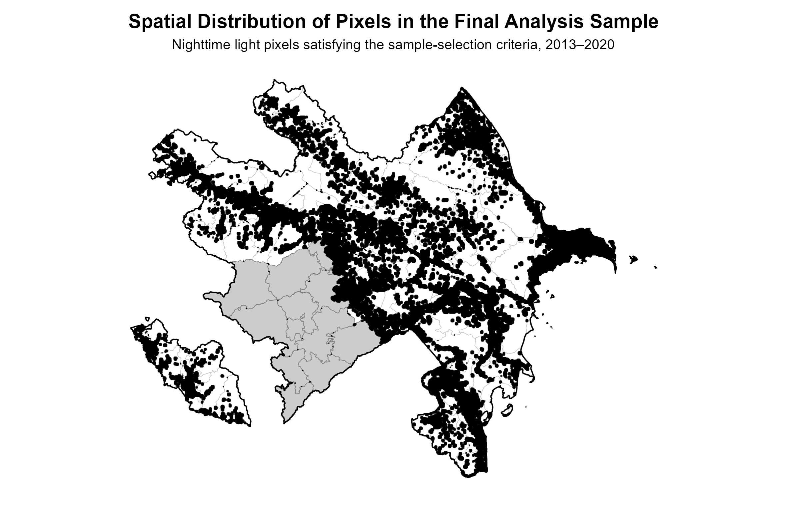
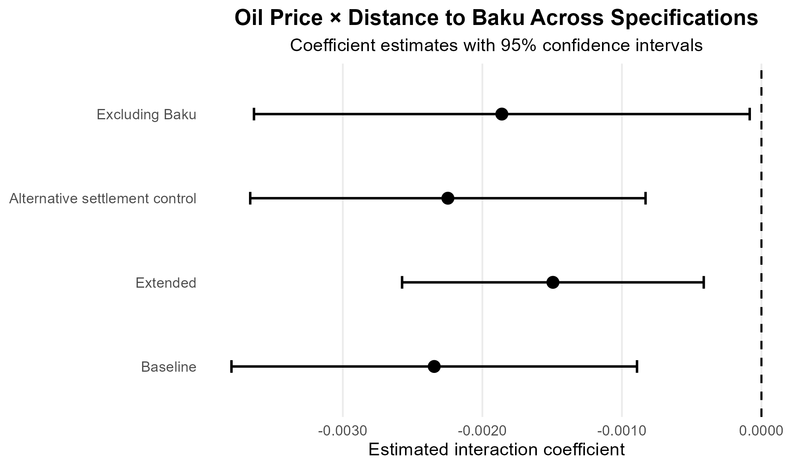

# Roads, Oil and Local Economic Activity in Azerbaijan

> **Master's Thesis Replication Repository**  
> TU Dresden – Faculty of Business and Economics  
> M.Sc. Public and International Economics  
> 2026

---

# ⚠️ IMPORTANT: Download the Data Before Running the Analysis

The `Data/` directory is not stored directly in this GitHub repository because the underlying spatial and raster datasets are too large for GitHub.

Before running the analysis, download the complete data folder from TU Dresden Datashare:

### 📥 Data download
**https://datashare.tu-dresden.de/s/djs3qW6nd2n9Dms**

After downloading the data:

1. Download the complete **`Data`** folder from the link above.
2. Place the downloaded `Data` folder directly in the root directory of this repository.
3. Open the RStudio project file:

   **`Master Thesis Elvin.Rproj`**

4. After the RStudio project has opened, open:

   **`VIIRS.Rmd`**

5. Run `VIIRS.Rmd` from the beginning.

The project uses relative file paths. Therefore, if the downloaded `Data/` folder is placed in the repository root and the analysis is started by opening `Master Thesis Elvin.Rproj`, the paths used in `VIIRS.Rmd` will point to the appropriate project files and datasets.

---

## 📁 Repository Structure

The repository should have the following structure after downloading the data:

```text
Master-Thesis-Elvin/
│
├── Data/
│   └── [download from TU Dresden Datashare]
│
├── Figures/
│   ├── administrative_settlements_azerbaijan.png
│   ├── azerbaijan_administrative_map.pdf
│   ├── descriptive_statistics.tex
│   ├── final_analysis_sample_pixels.png
│   ├── max_ntl_intensity_2013_2020.pdf
│   ├── maximum_ntl_azerbaijan_2013_2020.png
│   ├── nighttime_lights_major_roads_2013_2020...
│   ├── oil_price_distance_coefficient_plot.png
│   └── road_network_azerbaijan.png
│
├── VIIRS.Rmd
├── Master Thesis Elvin.Rproj
├── Elvin Master Thesis uptaded version.docx
├── Thesis_presentation_Elvin.pdf
├── README.md
├── .gitignore
├── .RData
└── .Rhistory
```

The main replication script is **`VIIRS.Rmd`**.

---

## 📌 Project Overview

This repository contains the data-processing workflow, spatial analysis, empirical estimation, figures, and replication material for my Master's thesis:

**Roads, Oil and Local Economic Activity in Azerbaijan**

The thesis examines whether the relationship between international oil-price fluctuations and local economic activity varies geographically within Azerbaijan.

Local economic activity is measured using high-resolution satellite-based **nighttime light intensity (NTL)**. The empirical strategy combines annual variation in the **real Brent crude oil price** with cross-sectional variation in geographical distance from **Baku**, Azerbaijan's main economic center.

The main analysis covers the period **2013–2020**.

---

## 🔬 Research Question

> **How does the relationship between international oil-price fluctuations and local economic activity vary with geographical distance from Baku in Azerbaijan?**

The analysis additionally examines whether this spatial relationship remains after accounting for differences in proximity to cities and major roads.

---

## 💾 Data Sources

The empirical analysis combines several spatial and economic datasets.

| Data Source | Variable / Use | Spatial Resolution | Temporal Coverage |
| :--- | :--- | :--- | :--- |
| **VIIRS Nighttime Lights** | Nighttime light intensity | Approx. 500 m pixels | 2013–2020 |
| **World Bank Commodity Price Data (Pink Sheet)** | Real Brent crude oil price | Annual / national | 2013–2020 |
| **OpenStreetMap / HOT Export** | Major and secondary road network | Vector road network | Static snapshot |
| **REİS / IDDA Open Data Portal** | Administrative settlements | Point locations | Static |
| **REİS / IDDA Open Data Portal** | Administrative boundaries | District polygons | Static |

The final analysis sample contains **113,961 unique nighttime light pixels**, observed annually over eight years, resulting in **911,696 pixel-year observations**.

---

## 📐 Empirical Strategy

The baseline empirical specification is:

\[
\ln(1 + NTL_{it})
=
\beta
\left[
OilPrice_t \times \ln(1 + DistanceBaku_i)
\right]
+
\alpha_r
+
\lambda_t
+
\varepsilon_{it}
\]

where:

- \(NTL_{it}\) is nighttime light intensity for pixel \(i\) in year \(t\);
- \(OilPrice_t\) is the annual real Brent crude oil price;
- \(DistanceBaku_i\) is the geographical distance from pixel \(i\) to Baku;
- \(\alpha_r\) represents district fixed effects;
- \(\lambda_t\) represents year fixed effects;
- \(\varepsilon_{it}\) is the error term.

Standard errors are clustered at the **district level**.

Because the Brent oil price varies only over time, its standalone coefficient is absorbed by the year fixed effects. The main coefficient of interest is therefore the interaction between the real Brent oil price and log distance from Baku.

---

## 📐 Extended Specification

The extended specification includes two additional spatial controls:

- log distance to the nearest city;
- log distance to the nearest major road.

These variables are included to examine whether the estimated oil-price–distance relationship remains after accounting for basic differences in urban proximity and road accessibility.

The road and settlement variables are treated as time-invariant spatial characteristics and are not given a direct causal interpretation because complete historical information for the full 2013–2020 period is unavailable.

---

## 🧪 Robustness Checks

Two main robustness checks are implemented.

### 1. Alternative Settlement Specification

The continuous city and road controls are replaced by the type of the nearest administrative settlement:

- Village
- Town
- City

### 2. Excluding Baku

All nighttime light pixels located within the administrative districts of Baku are excluded and the extended model is re-estimated.

Distance to Baku is retained for all remaining pixels.

---

## 📊 Selected Figures

### Maximum Nighttime Light Intensity, 2013–2020



The figure shows the maximum nighttime light intensity observed for each retained pixel during the 2013–2020 period.

---

### Major and Secondary Road Network



The road-network dataset is used to calculate pixel-level distances to major and secondary roads. Distance to the nearest major road is used as the road-accessibility control in the final extended specification.

---

### Administrative Settlements



The settlement data are used to calculate distance to the nearest city and to identify the type of the nearest administrative settlement.

---

### Final Analysis Sample



The figure shows the spatial distribution of nighttime light pixels retained in the final empirical sample.

---

### Oil Price × Distance to Baku Interaction



This figure compares the estimated interaction coefficient across the baseline, extended, and robustness specifications.

---

## 📈 Main Results

The estimated interaction between the real Brent oil price and log distance from Baku is negative across all main specifications.

| Specification | Oil Price × Log Distance to Baku |
| :--- | ---: |
| Baseline | -0.00235*** |
| Extended | -0.00149*** |
| Alternative settlement control | -0.00225*** |
| Excluding Baku | -0.00186** |

The results indicate that periods of higher oil prices are associated with relatively stronger nighttime-light outcomes in locations closer to Baku and relatively weaker outcomes in more distant locations.

The estimates should be interpreted as evidence of **spatial heterogeneity in the relationship between international oil-price conditions and local economic activity**, rather than as the overall causal effect of oil prices on the Azerbaijani economy.

---

## 🚀 How to Reproduce the Analysis

### Step 1 — Clone the Repository

```bash
git clone https://github.com/mammadov-elvin/Master-Thesis-Elvin.git
cd Master-Thesis-Elvin
```

### Step 2 — Download the Data

Download the complete data directory from:

**https://datashare.tu-dresden.de/s/djs3qW6nd2n9Dms**

Place the downloaded folder here:

```text
Master-Thesis-Elvin/
└── Data/
```

### Step 3 — Open the RStudio Project

Open:

```text
Master Thesis Elvin.Rproj
```

Opening the `.Rproj` file ensures that the repository root is used as the working project directory.

### Step 4 — Open and Run the Main Analysis File

Open:

```text
VIIRS.Rmd
```

Run the file from the beginning.

`VIIRS.Rmd` contains the main workflow used for:

- importing and processing VIIRS nighttime light data;
- constructing the persistent nighttime light pixel sample;
- assigning pixels to administrative districts;
- applying the geographical exclusions;
- calculating distance to Baku;
- processing the road network;
- calculating distance to major roads;
- processing administrative settlement data;
- calculating distance to the nearest city;
- identifying the type of the nearest settlement;
- combining annual Brent oil-price data with the spatial panel;
- constructing the final pixel-year dataset;
- estimating the baseline fixed-effects specification;
- estimating the extended specification;
- estimating the robustness specifications;
- producing descriptive statistics;
- generating maps, tables, and regression figures.

---

## ⚠️ Important Notes for Replication

- The analysis should be started by opening **`Master Thesis Elvin.Rproj`**, rather than by opening `VIIRS.Rmd` directly from outside the project.
- The downloaded **`Data/` folder must remain in the repository root**.
- The original folder structure should not be changed because the R code uses relative paths.
- Some spatial datasets and intermediate objects are large, so execution time and memory requirements may vary across computers.
- Generated figures are stored in the **`Figures/`** directory.

---

## ⚠️ Interpretation and Limitations

Several limitations should be considered when interpreting the results:

- Nighttime light intensity is a proxy for local economic activity rather than a direct measure of GDP.
- The analysis covers eight years, limiting the amount of annual variation in international oil prices.
- The road and settlement datasets do not provide complete historical information for every year between 2013 and 2020.
- Road and settlement characteristics are therefore treated as time-invariant spatial variables.
- The analysis documents spatial heterogeneity in the relationship between oil-price fluctuations and local economic activity but does not identify the exact transmission mechanism.

---

## 🎓 Thesis Information

**Author:** Elvin Mammadov  
**University:** TU Dresden  
**Faculty:** Faculty of Business and Economics  
**Program:** M.Sc. Public and International Economics  
**Year:** 2026  

**Thesis title:**  
*Roads, Oil and Local Economic Activity in Azerbaijan*

---

## 📄 Citation

If you use material from this replication repository, please cite:

> Mammadov, Elvin (2026). *Roads, Oil and Local Economic Activity in Azerbaijan*. Master's Thesis, TU Dresden, Faculty of Business and Economics.

---

## 📬 Contact

For questions regarding the replication material or empirical analysis, please contact the author through the repository or through the contact information provided in the thesis.